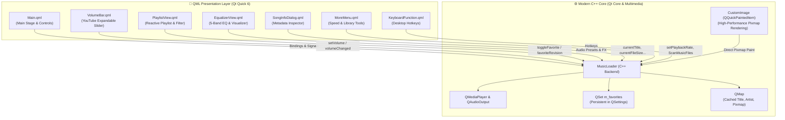

# 🎵 Modern Music Player (Qt 6 QML & C++)

<p align="center">
  
</p>

<p align="center">
  <strong>A high-performance, elegant, and modern desktop audio player built with Qt 6, QML, and Modern C++.</strong><br>
  Inspired by the sleek user experiences of YouTube Music and Spotify, featuring responsive animations, an expandable YouTube-style volume controller, a 5-band equalizer with live visualizer, and instant reactive playlist synchronization.
</p>

<p align="center">
  <a href="https://github.com/caohuypy2002/Music-Player/stargazers"></a>
  <a href="https://github.com/caohuypy2002/Music-Player/network/members"></a>
  <a href="https://github.com/caohuypy2002/Music-Player/issues"></a>
  <a href="https://www.qt.io/"></a>
  <a href="https://isocpp.org/"></a>
  <a href="https://cmake.org/"></a>
  <a href="LICENSE"></a>
</p>

---

## 📑 Table of Contents
- [✨ Key Features](#-key-features)
- [📸 User Interface Showcase](#-user-interface-showcase)
- [🏛️ Architectural Overview](#️-architectural-overview)
- [🧩 Technical Deep-Dive & Engineering Highlights](#-technical-deep-dive--engineering-highlights)
- [⌨️ Keyboard Shortcuts](#️-keyboard-shortcuts)
- [📂 Project Directory Structure](#-project-directory-structure)
- [🚀 Getting Started & Build Instructions](#-getting-started--build-instructions)
  - [Prerequisites](#prerequisites)
  - [Building via CMake & Ninja](#building-via-cmake--ninja)
  - [Building via Qt Creator](#building-via-qt-creator)
- [🔮 Roadmap & Future Enhancements](#-roadmap--future-enhancements)
- [👨‍💻 Author & Acknowledgements](#-author--acknowledgements)
- [📜 License](#-license)

---

## ✨ Key Features

### 🎧 Core Audio & Playback Engine
* **Universal Format Support:** Smooth playback of MP3, WAV, FLAC, M4A, AAC, and OGG powered by `QtMultimedia` (`QMediaPlayer` + `QAudioOutput`).
* **Playback Modes:** Shuffle (random non-repeating algorithm) and Single-track Loop / Auto-replay with automatic mutual exclusion.
* **Granular Playback Rate Control:** On-the-fly speed adjustments from `0.5x`, `0.75x`, `1.0x`, `1.25x`, `1.5x`, to `2.0x`.
* **Precision Seek Bar:** YouTube-style hover ghost preview, real-time floating timestamp tooltip, and drag-and-drop seek synchronization.

### 🔊 YouTube-Style Expandable Volume Bar
* **Expandable Horizontal Slider:** Expands horizontally when hovering over the speaker button and collapses automatically after interaction.
* **Volume Tooltip:** Floating badge displaying exact volume percentage (0% – 100%).
* **Scroll-Wheel Volume Modulation:** Scroll the mouse wheel anywhere over the speaker or slider to step volume up/down by 5%.
* **Smart Mute Toggle:** One-click mute toggle that memorizes previous non-zero volume and restores it seamlessly.

### 🎚️ Equalizer & Dancing Spectrum Visualizer
* **5-Band Audio Equalizer:** Custom frequency gain adjustment spanning `60Hz` (Sub-bass), `230Hz` (Bass), `910Hz` (Mid), `3.6kHz` (High), and `14kHz` (Treble) from `-12dB` to `+12dB`.
* **Preset Profiles:** Instant audio presets for **Flat**, **Bass Boost**, **Rock**, **Pop**, **Vocal**, and **Electronic**.
* **Dancing Spectrum Visualizer:** Real-time animated rhythmic frequency bars reacting to playback state.

### ❤️ Smart Playlist & Reactive Favorite System
* **Instant Two-Way Synchronization:** Liking a song from either the main player screen or the playlist row immediately updates both views in real-time with smooth scale bounce animations.
* **Favorite Filter & Counter:** Filter the playlist to display only favorite tracks with live badge count (`Favorites (3)` vs `Playlist (9)`).
* **Non-Overlapping Flex Layout:** Robust `RowLayout` preventing UI overflow issues.
* **Polished Empty State:** Friendly contextual empty-state placeholder (`💔 No favorites yet`) with quick instructions.
* **Quick Song Removal & Native File Import:** Add individual or multiple audio files directly via native system file pickers, or remove songs with one click.

### ℹ️ Comprehensive Metadata & System Integration
* **Asynchronous Tag Extraction:** Reads ID3 Title, Artist, Album, and embedded cover art in the background without audio stutter.
* **Song Details Inspection:** Dialog displaying Track Title, Artist, Duration, Audio Format, File Size in MB, and Full File System Path.
* **Native File Explorer Integration:** Click any location link or button to reveal the file directly in Windows Explorer.

---

## 📸 User Interface Showcase

| Main Player Interface | Equalizer & Audio FX |
| :---: | :---: |
| Sleek glassmorphism backdrop with album art, track details, action bar, and YouTube-style volume slider. | 5-band slider equalizer, preset pills, and rhythmic dancing spectrum visualizer. |

| Playlist & Live Favorites Filter | Song Details Dialog |
| :---: | :---: |
| Interactive playlist with album thumbnails, active track indicator, and 1-click favorite syncing. | Detailed ID3 metadata, technical file format, file size, and Explorer shortcut. |

---

## 🏛️ Architectural Overview

The application adopts a **Hybrid C++ / QML Architecture** adhering to clean separation of concerns:



---

## 🧩 Technical Deep-Dive & Engineering Highlights

### 1. Solving QML Delegate Non-Reactivity (`favoriteRevision` Pattern)
* **The Problem:** In QML `ListView` delegates, calling a C++ `Q_INVOKABLE` method like `musicLoader.isFavorite(modelData)` inside a property binding does **not** create a reactive engine dependency because the method lacks a property notification signal. When favorites changed, existing delegates remained static.
* **The Solution:** We architected the **Reactive Property Revisioning Pattern**:
  ```cpp
  // MusicLoader.h
  Q_PROPERTY(int favoriteRevision READ favoriteRevision NOTIFY favoriteChanged)
  int favoriteRevision() const { return m_favoriteRevision; }
  ```
  Inside `PlaylistView.qml`:
  ```qml
  readonly property bool isFav: {
      if (!musicLoader) return false;
      var _rev = musicLoader.favoriteRevision; // Forces QML engine dependency tracking!
      return musicLoader.isFavorite(modelData);
  }
  ```
  Whenever `favoriteChanged` is emitted, `favoriteRevision` increments, triggering instant re-evaluation across all active delegate instances.

### 2. High-Performance Album Art with `CustomImage`
* Rather than incurring heavy disk I/O converting images to temporary files or base64 data URLs, album covers are extracted into `QPixmap` in C++ and rendered directly onto the QML scene graph using `QQuickPaintedItem` (`customimage.cpp`).

### 3. Asynchronous Metadata Extraction
* Audio files are scanned asynchronously using headless secondary `QMediaPlayer` instances. Metadata changes trigger UI cache updates without blocking the audio thread or causing UI jank.

---

## ⌨️ Keyboard Shortcuts

Enjoy complete hands-on-keyboard media control:

| Key | Action | Description |
| :---: | :---: | :--- |
| <kbd>Space</kbd> | **Play / Pause** | Toggle between playback and pause states |
| <kbd>→</kbd> | **Next Track** | Skip forward to the next song in the playlist |
| <kbd>←</kbd> | **Previous Track** | Jump back to the previous track |
| <kbd>↑</kbd> | **Volume Up** | Increment volume by +5% |
| <kbd>↓</kbd> | **Volume Down** | Decrement volume by -5% |
| <kbd>M</kbd> | **Mute / Unmute** | Toggle audio mute (restores prior volume level) |
| <kbd>F</kbd> or <kbd>L</kbd> | **Favorite / Like** | Toggle favorite status for the currently playing song |
| <kbd>P</kbd> | **Toggle Playlist** | Open or dismiss the Playlist window |
| <kbd>E</kbd> | **Toggle Equalizer** | Open or dismiss the Equalizer & Audio FX window |

---

## 📂 Project Directory Structure

```plaintext
MusicPlayer/
├── CMakeLists.txt              # Primary CMake build configuration
├── Resource.qrc                # Qt Resource bundle (Assets, SVGs, PNGs)
├── .gitignore                  # Git exclusion rules (build dirs, user configs)
├── README.md                   # Comprehensive project documentation
│
├── C++ Backend Core:
│   ├── main.cpp                # Application entrypoint & QML engine setup
│   ├── musicloader.h           # MusicLoader controller header & reactive properties
│   ├── musicloader.cpp         # Audio playback, playlist logic & QSettings persistence
│   ├── customimage.h           # Custom QQuickPaintedItem for QPixmap painting
│   └── customimage.cpp         # Direct paint pipeline implementation
│
├── QML User Interface:
│   ├── Main.qml                # Main application window & responsive layout
│   ├── CustomButton.qml        # Reusable animated button component with hover effects
│   ├── ProgressBar.qml         # Seek bar with hover timestamp preview & smooth scrubbing
│   ├── VolumeBar.qml           # YouTube-style expandable volume slider & mute button
│   ├── PlaylistView.qml        # Smart playlist window with favorite filters & empty states
│   ├── EqualizerView.qml       # 5-band frequency equalizer with animated visualizer
│   ├── MoreMenu.qml            # Popup menu for playback rate & library options
│   ├── SongInfoDialog.qml      # Technical metadata inspector & Explorer integration
│   └── KeyboardFunction.qml    # Desktop hotkey handler
│
├── Icon/                       # Vector & raster UI assets
│   ├── autoplay.svg
│   ├── equalizer.svg
│   ├── heart.svg
│   ├── heart-filled.svg
│   ├── mute.png
│   ├── next-track.svg
│   ├── pause.svg
│   ├── play.svg
│   ├── playlist.svg
│   ├── plus.svg
│   ├── repeat.svg
│   ├── rose-petals.svg
│   ├── shuffle.svg
│   ├── threedotvertical.svg
│   ├── vinyl.png
│   └── volume.svg
│
└── Music/                      # Default local audio sample directory
```

---

## 🚀 Getting Started & Build Instructions

### Prerequisites
* **C++ Compiler:** Supporting C++17 or C++20 (GCC/MinGW 11.2+, Clang 13+, or MSVC 2019+).
* **Qt Framework:** Qt 6.6 or higher (Qt 6.9.3 recommended) with the following modules installed:
  * `Qt Quick`
  * `Qt Multimedia`
  * `Qt Core`
* **Build Tools:** CMake 3.16+ and Ninja (recommended).

---

### Building via CMake & Ninja

1. **Clone the repository:**
   ```bash
   git clone https://github.com/caohuypy2002/Music-Player.git
   cd Music-Player
   ```

2. **Configure the project:**
   ```bash
   cmake -B build -G Ninja -DCMAKE_BUILD_TYPE=Release -DCMAKE_PREFIX_PATH="C:/Qt/6.9.3/llvm-mingw_64"
   ```
   *(Replace `"C:/Qt/6.9.3/llvm-mingw_64"` with the actual path to your Qt 6 installation directory).*

3. **Compile the executable:**
   ```bash
   cmake --build build --config Release
   ```

4. **Run the application:**
   ```bash
   # On Windows
   ./build/appASSIGMENT_MusicPlayer.exe
   ```

---

### Building via Qt Creator

1. Open **Qt Creator**.
2. Select **File** > **Open File or Project...** and select `CMakeLists.txt`.
3. Choose your desired Qt 6 Desktop Kit (e.g., *Desktop Qt 6.9.3 LLVM-MinGW 64-bit*).
4. Click **Configure Project**.
5. Press <kbd>Ctrl</kbd> + <kbd>R</kbd> to build and run!

---

## 🔮 Roadmap & Future Enhancements

- [ ] **Synchronized Lyrics (.LRC):** Real-time synced karaoke-style lyrics display.
- [ ] **Online Stream Playback:** Support streaming audio from direct HTTP/HTTPS URLs and internet radio.
- [ ] **System Tray Integration:** Minimize to notification area with mini background playback controls.
- [ ] **Theme Customizer:** Light, Dark, Cyberpunk, and custom glassmorphism color accent pickers.
- [ ] **Cross-Platform Audio Effects:** Deep DSP equalizer filters utilizing native Qt Audio APIs.

---

## 👨‍💻 Author & Acknowledgements

* **Author:** [Cao Huy](https://github.com/caohuypy2002)
* **Framework:** Powered by the incredible [Qt Project](https://www.qt.io/)
* **Icons:** Designed with love, styled after YouTube Music and modern design systems.

---

## 📜 License

This project is licensed under the **MIT License** — feel free to use, modify, and distribute for educational and commercial purposes. See the [LICENSE](LICENSE) file for details.

<p align="center">
  Made with ❤️ by <a href="https://github.com/caohuypy2002">Cao Huy</a>
</p>
